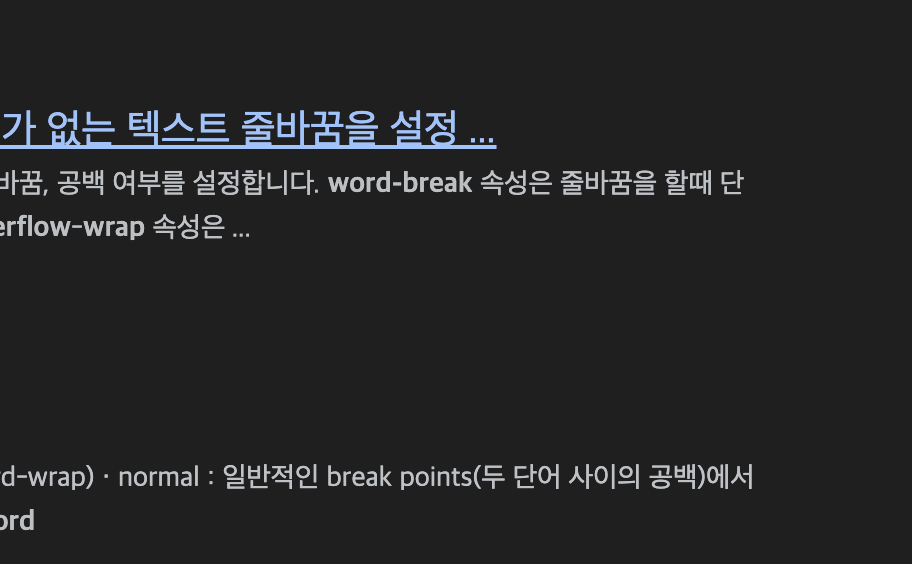

<Callout type="info">
**이 시리즈는 총 4개의 컨텐츠로 기획되어 있습니다.**

1. [에셋 관리 시스템을 만들어보자 (에셋타운 1편 - 개요)](https://junghyeonsu.com/posts/asset-town-introduction/)
2. [에셋 관리 시스템을 만들어보자 (에셋타운 2편 - Sanity를 이용한 어드민)](https://junghyeonsu.com/posts/asset-town-admin-with-sanity/)
3. **에셋 관리 시스템을 만들어보자 (에셋타운 3편 - Cloudflare Workers, R2를 이용한 웹훅 처리와 CDN 캐싱) [현재 글]**
4. [에셋 관리 시스템을 만들어보자 (에셋타운 4편 - Figma Plugin을 이용한 에셋 전시)](https://junghyeonsu.com/posts/asset-town-figma-plugin/)
</Callout>

<Callout type="danger">
해당 프로젝트는 일주일 만에 만들어진 프로젝트로 추후에는 많은 변경이 있을 수도 있습니다.
</Callout>

## Sanity의 CDN을 이용하지 않는 이유

Sanity에서 데이터베이스에 에셋들을 올리면 기본적으로 CDN URL이 제공됩니다.
하지만 이전에 1편에서 언급했듯, CDN 한 달 무료 범위는 1,000,000 (백만) 요청까지 무료입니다.


[](https://heropy.dev/)

1,000,000 이라는 숫자가 크게 보일 수 있지만, 단순 조회에 대한 숫자이기 때문에 실제로는 엄청 빠르게 올라갈 수 있습니다.
특히 제가 현재 몸 담고 있는 당근과 같은 트래픽이 많은 곳들에서는 이런 비용이 큰 부담이 될 수 있습니다.
그래서 신경써주지 않으면 과금 폭탄을 맞을 수 있습니다.

그래서 이번 글에서는 에셋에 대한 원본은 Sanity에 저장하고
에셋에 대한 수정이나 삭제나 추가에 대한 이벤트를 받아서 Cloudflare Workers에 전달되고
Cloudflare Workers에서 R2에 캐싱을 하고 CDN URL을 제공하는 방법에 대해 설명하겠습니다.

## Sanity Webhook 등록하기

<Callout type="info">
[Webhook](https://docs.tosspayments.com/resources/glossary/webhook)은 특정 이벤트가 발생했을 때, 지정된 URL로 HTTP 요청을 보내는 것을 말합니다.
</Callout>

위에서 설명되어있듯, Webhook은 특정 이벤트가 발생했을 때, 지정된 URL로 HTTP 요청을 보내는 것을 말합니다.

Sanity에서는 `Create`, `Update`, `Delete`에 대한 이벤트 Webhook을 등록할 수 있습니다.

{/*  */}

Sanity에서는 총 2개의 Webhook을 무료로 등록할 수 있습니다.
이 Webhook을 처리해줄 서버를 만들어야 합니다. 우리는 이 서버를 Cloudflare Workers를 이용해서 만들거구요.

간단하게 Webhook 등록 화면을 살펴볼까요?

{/*  */}

위에서부터 하나씩 살펴보면

1. Name (Webhook 이름)
2. Description (Webhook 설명)
3. **URL (Webhook을 처리해줄 서버 URL)**
4. **Dataset (어떤 데이터셋에 대한 Webhook인지)**
5. **Trigger On (어떤 이벤트에 대한 Webhook인지)**
6. **Filter (어떤 필터를 걸어서 Webhook을 처리할지)**
7. **Projection (어떤 필드에 대한 Webhook인지)**

이렇게 7개 옵션 이외에도 `Status`, `HTTP Method`, `Headers` 등의 옵션을 설정할 수 있습니다.
요기서 저희는 3번부터 7번까지 집중하면 좋은데요, 어떤식으로 웹훅 전략을 가져갈지 생각해보겠습니다.

## Webhook 전략

<Callout type="info">
[Sanity Webhook 공식 문서](https://www.sanity.io/docs/webhooks)
</Callout>

URL은 Cloudflare Workers를 생성하게 되면 기본적인 URL을 제공받을 수 있습니다.
해당 URL을 Webhook URL로 등록하면 됩니다.

총 두 개의 Webhook을 무료로 만들 수 있기 때문에 `Create`, `Update`에 대한 이벤트를 동시에 처리하는
Webhook 하나랑 `Delete`를 처리하는 Webhook 하나를 만들어서 이렇게 두 개로 운영할겁니다.

- `Create`, `Update`에 대한 이벤트를 받아서 처리할 Webhook: `https://<your-worker-url>/api/update`
- `Delete`에 대한 이벤트를 받아서 처리할 Webhook: `https://<your-worker-url>/api/delete`

그리고 Dataset 같은 경우는 Webhook의 Headers에 담겨져 오는 데이터를 통해서
Develop 환경과 Production 환경에 대한 처리를 따로 해줄 수 있기 때문에 `all dataset`으로 처리할 것입니다.

Webhook에 Headers에 담겨져 오는 데이터는 아래와 같습니다. (참고)

```json showLineNumbers
{
  "conection": "close",
  "accept-encoding": "gzip",
  "idempotency-key": "<a unique key>",
  "content-type": "application/json",
  "content-length": "<the length of the payload in bytes>",
  "user-agent": "Sanity.io webhook delivery",
  "host": "<the endpoint URL host>",
  "sanity-transaction-id": "<ID of transaction>",
  "sanity-transaction-time": "<Timestamp of transaction>",
  "sanity-dataset": "<Name of dataset (also available in projection today as sanity::dataset())>",
  "sanity-document-id": "<Document ID being notified about>",
  "sanity-project-id": "<ID of project (also available in projection today as sanity::projectId())>",
  "sanity-webhook-id": "<ID of webhook>"
}
```

그리고 Filter와 Projection 같은 경우는 Webhook을 처리할 때 필요한 데이터를 걸러내거나
필요한 데이터만 가져올 수 있도록 하는 옵션입니다. GROQ 쿼리를 이용하기 때문에 자신의 프로젝트에 맞게
설정하면 됩니다. 저 같은 경우에는 Sanity에서 에셋에 대한 메타데이터 대부분을 들고옵니다.
Cloudflare R2에 저장할 때 `Custom Metadata` 필드에 저장해서 추후에 이용할 수 있도록 합니다.

참고로 저는 Webhook의 Filter와 Projection을 아래와 같이 설정했습니다.

```groq showLineNumbers
// Filter
*[_type in ["lottie", "svg", "gif"]]

// Projection
{
  _id,
  _type,
  title,
  description,
  lottie -> {
    url,
    originalFilename,
    uploadId,
    assetId,
    extension,
    mimeType,
    path,
    _id,
    _type,
    _createdAt,
    _updatedAt
  },
  svg -> {
    ... 위와 동일
  },
  gif -> {
    ... 위와 동일
  }
}
```

[ ] : a link 로 나오는데.. 이 문제 해결해야함
## Cloudflare Workers를 이용한 Webhook 처리

<Callout type="info">
[Cloudflare Workers](https://www.cloudflare.com/ko-kr/developer-platform/workers/)는 Cloudflare에서 제공하는 서버리스 플랫폼입니다. 이를 이용하여 자바스크립트 코드로 HTTP 요청을 처리하는 서버를 만들 수 있습니다.
</Callout>

이제는 Cloudflare Workers를 이용하여 Webhook을 처리하는 서버를 만들어보겠습니다.

Cloudflare Workers는 기본적으로 JavaScript 혹은 TypeScript로 작성할 수 있습니다.
그리고 REST API를 이용하여 HTTP 요청을 처리할 수 있습니다. 그러기 위해서는 [itty-router](https://github.com/kwhitley/itty-router)를 이용하여 라우팅을 처리할 수 있습니다.

위에서 설명했듯, 우리는 두 개의 Webhook을 처리할 것이기 때문에 두 개의 Route를 만들어야 합니다.

```typescript showLineNumbers
// https://github.com/junghyeonsu/asset-town/blob/main/workers/src/index.ts
import { Router } from "itty-router";

import { handleOptions } from "./helper"; // CORS 처리를 위한 함수
import { deleteLottieFromBucket, putLottieFromBucket } from "./api/lottie";

const router = Router();

router.put("/api/v1/lottie", putLottieFromBucket);
router.delete("/api/v1/lottie", deleteLottieFromBucket);
```

위 코드에서 보이는 것처럼 `putLottieFromBucket`과 `deleteLottieFromBucket` 함수를 만들어서
각각의 Route에 대한 요청을 처리할 수 있도록 합니다.

현재는 lottie에 대한 요청만 처리할 수 있도록 만들었지만, 다른 에셋에 대한 요청도 처리할 수 있도록 만들 수 있습니다.

Cloudflare는 기본적으로 각 서비스끼리 연동성이 좋아서 R2 버킷을 생성하고 Workers의 설정 파일에 R2 버킷을 연동할 수 있습니다.

```toml showLineNumbers
name = "sanity-proxy"
main = "src/index.js"
compatibility_date = "2022-07-12"

workers_dev = false

{/* Workers와 R2 버킷 연결 */}
r2_buckets  = [
  { binding = "ASSET_TOWN_CDN_BUCKET", bucket_name = "asset-town-cdn-prod"},
]
```

위와 같이 설정을 하고 나면 아래와 같이 코드를 작성할 수 있습니다.

```typescript showLineNumbers
// 에셋에 대해서 들고오는 타입
interface SanityAsset {
  url: string;
  originalFilename: string;
  uploadId: string;
  assetId: string;
  extension: string;
  mimeType: string;
  path: string;
  _id: string;
  _type: string;
  _createdAt: string;
  _updatedAt: string;
}

// Projection에 대한 타입
interface SanityRequest {
  _id: string;
  _type: string;
  title: string;
  description: string;

  // 에셋들 (Filter를 통해서 가져온 에셋들입니다.)
  // Filter: *[_type in ["lottie", "svg", "gif"]]
  lottie: SanityAsset;
  svg: SanityAsset;
  gif: SanityAsset;
}

// src/api/lottie.ts

const SANITY_USER_AGENT = "Sanity.io webhook delivery"; // Webhook을 처리할 때 User-Agent를 체크하기 위한 상수

/**
 * lottie에 대한 요청을 처리하는 함수
 * 
 * request는 Webhook을 통해서 들어오는 요청에 대한 정보가 들어있습니다.
 * env는 Cloudflare Workers의 설정 파일에 있는 R2 버킷에 대한 정보가 들어있습니다.
 * 자세한 내용은 공식문서를 참고해주세요: https://developers.cloudflare.com/r2/api/workers/workers-api-usage/
 */
export const putLottieFromBucket = async (request: Request, env: Env): Promise<Response> => {
  // Webhook을 처리할 때 User-Agent를 체크합니다.
  if (request.headers.get("user-agent") !== SANITY_USER_AGENT) {
    return new Response(JSON.stringify({ message: "Unauthorized" }), {
      headers: {
        "Content-Type": "application/json",
        "Access-Control-Allow-Origin": "*",
      },
      status: 401,
    });
  }

  // request 객체에 들어있는 정보를 JSON으로 변환합니다.
  // 그럼 Webhook 설정에서 설정한 Filter와 Projection에 대한 정보를 가져올 수 있습니다.
  const asset = await request.json<SanityRequest>();

  // Webhook을 처리할 때 Dataset에 대한 정보를 가져옵니다.
  // 환경 분리를 위해서 사용합니다.
  const dataset = request.headers.get("sanity-dataset");

  if (asset.lottie) {
    const lottie = await fetch(asset.lottie.url, {
      headers: {
        "Content-Type": "application/json",
      },
    }).then((response) => response.json());
    /**
     * R2는 /로 폴더를 구분합니다.
     * @example development/lottie/1234/5678.json
     * @example production/lottie/abcd/efgh.json
     * 위와 같이 구분할 수 있습니다.
     * 
     * R2에 저장할 데이터 스키마는 자신이 정하기 나름입니다.
     */
    const lottiePath = `${dataset}/${asset._type}/${asset._id}/${asset.lottie.assetId}.${asset.lottie.extension}`;

    try {
      // env.{wrangler.toml에 설정한 R2 버킷 이름}으로 R2에 대한 다양한 메서드를 사용할 수 있습니다.
      await env.ASSET_TOWN_CDN_BUCKET.put(lottiePath, JSON.stringify(lottie), {
        httpMetadata: {
          contentType: asset.lottie.mimeType,
        },
        // Custom Metadata에 대한 정보를 넣을 수 있습니다.
        customMetadata: {
          ...asset.lottie,
        },
      });
    } catch {
      return new Response(JSON.stringify({ message: "Lottie Put Failed!!!" }), {
        headers: {
          "Content-Type": "application/json",
          "Access-Control-Allow-Origin": "*",
        },
        status: 500,
      });
    }
  }
}
```

`Delete`에 대한 함수도 위와 같이 비슷하게 작성됩니다.
그리고 현재는 `lottie` 에셋에 대해서만 처리를 할 수 있지만, 함수를 조금 리팩토링한다면 다른 에셋에 대해서도 처리할 수 있습니다.

위와 같이 Cloudflare Workers를 이용하여 Webhook을 처리할 수 있습니다.
이렇게 하고 이제 Sanity에서 에셋을 업로드하거나 수정하거나 삭제하면 Webhook이 발생하고 Cloudflare Workers에 전달되게 됩니다.
그러면 Cloudflare Workers에서 해당 에셋을 다시 R2에 저장합니다.

## R2를 이용한 CDN 캐싱

<Callout type="info">
[Cloudflare R2](https://www.cloudflare.com/ko-kr/developer-platform/r2/)는 Cloudflare에서 제공하는 버킷 서비스입니다. 이 버킷을 이용하여 에셋을 캐싱할 수 있습니다.
AWS의 S3와 비슷한 역할을 합니다.
</Callout>

Sanity는 CDN 조회에 대한 비용을 청구하지만, Cloudflare R2는 CDN 조회에 대한 비용을 청구하지 않습니다.
**단, 조건은 자신의 커스텀 도메인을 R2에 연결하고 R2를 Public하게 오픈해야 합니다.**

그리고 Cloudflare R2에서 제공하는 기본적인 캐싱 정책에 대한 문서에 적혀있는
기본적으로 캐싱이 되는 파일들의 확장자들은 아래와 같습니다.

{/*  */}

이렇게 R2에 커스텀 도메인까지 연결하면 CDN 조회에 대한 비용을 청구하지 않고
유저에게 에셋에 대한 Public URL을 무료로 제공할 수 있습니다.

Sanity에서 제공하는 CDN 조회에 대한 비용을 줄이기 위해 약간의 해키한 방법을 사용했습니다.

Sanity에서 날라오는 Webhook 정보를 통해서 Cloudflare R2에 저장할 때
예측 가능하고 확장 가능한 URL 포맷을 정의하고, 그 포맷에 맞게 저장해야 합니다.

그리고 유저에게 URL을 제공할 때도 R2에 저장된 URL을 제공해야 하기 때문에
`Sanity CDN to R2 CDN`과 같은 유틸 함수를 생성하거나 매핑을 해야 합니다.

```typescript showLineNumbers
// utils/url.ts

/**
 * Sanity CDN URL을 R2 CDN URL로 변환하는 함수
 * 
 * @param {string} url - Sanity CDN URL
 * @param {string} dataset - Dataset 이름
 * @param {string} type - 에셋 타입
 * @param {string} id - 에셋 ID
 * @param {string} assetId - 에셋 Asset ID
 * @param {string} extension - 에셋 확장자
 * @returns {string} - R2 CDN URL
 */
export const sanityCdnToR2Cdn = (url: string, dataset: string, type: string, id: string, assetId: string, extension: string): string => {
  const r2CdnUrl = new URL(url);
  r2CdnUrl.hostname = `{your-r2-custom-domain}`; // R2 커스텀 도메인
  r2CdnUrl.pathname = `${dataset}/${type}/${id}/${assetId}.${extension}`;
  return r2CdnUrl.toString();
};
```

## 마치며

이번 글에서는 에셋타운에서 Cloudflare Workers와 R2를 이용하여 웹훅을 처리하고 CDN 캐싱을 제공하는 방법에 대해 설명했습니다.
다음 글에서는 Figma Plugin을 이용하여 에셋을 전시하는 방법에 대해 설명하겠습니다.

## 참고

- [Sanity Webhook 공식 문서](https://www.sanity.io/docs/webhooks)
- [Cloudflare Workers 공식 문서](https://developers.cloudflare.com/workers)
- [Cloudflare R2 공식 문서](https://developers.cloudflare.com/r2)
- [itty-router](https://github.com/kwhitley/itty-router)
- [Cloudflare R2 Public Bucket](https://developers.cloudflare.com/r2/buckets/public-buckets/)
- [Cloudflare R2 Default Cache Behavior](https://developers.cloudflare.com/cache/concepts/default-cache-behavior/)


[`rehype-pretty-code`](https://github.com/atomiks/rehype-pretty-code) is a Rehype plugin powered by the
[`shiki`](https://github.com/shikijs/shiki) syntax highlighter that provides beautiful code blocks for Markdown or MDX. It works on both the server at build-time (avoiding runtime syntax highlighting) and on the client for dynamic highlighting.

## Editor-Grade Highlighting

<span className="mix-blend-plus-lighter text-zinc-400/80">
  Enjoy the accuracy and granularity of VS Code's syntax highlighting engine and
  the popularity of its themes ecosystem — use any VS Code theme you want!
</span>

## Line Numbers and Line Highlighting

Draw attention to a particular line of code.

```js {4} showLineNumbers
import { useFloating } from "@floating-ui/react";

function MyComponent() {
  const { refs, floatingStyles } = useFloating();

  return (
    <>
      <div ref={refs.setReference} />
      <div ref={refs.setFloating} style={floatingStyles} />
    </>
  );
}
```

## Word Highlighting

Draw attention to a particular word or series of characters.

```js /floatingStyles/
import { useFloating } from "@floating-ui/react";

function MyComponent() {
  const { refs, floatingStyles } = useFloating();

  return (
    <>
      <div ref={refs.setReference} />
      <div ref={refs.setFloating} style={floatingStyles} />
    </>
  );
}
```

## ANSI Highlighting

```ansi
  vite v5.0.0 dev server running at:
  > Local: http://localhost:3000/
  > Network: use `--host` to expose
  ready in 125ms.
8:38:02 PM [vite] hmr update /src/App.jsx
```

Inline ANSI: `> Local: http://localhost:3000/{:ansi}`

---

### Kitchen Sink Meta Strings

```js showLineNumbers {2-4} title="isEven.js" /console/ caption="Im a caption"
function isEven(number) {
  if (number === 1) {
    return false;
  } else if (number === 2) {
    return true;
  } else if (number === 3) {
    return false;
  } else if (number === 4) {
    return true;
  } else if (number === 5) {
    return false;
  } else if (number === 6) {
    return true;
  } else if (number === 7) {
    return false;
  } else if (number === 8) {
    return true;
  } else if (number === 9) {
    return false;
  } else if (number === 10) {
    return true;
  } else {
    return "Number is not between 1 and 10.";
  }
}

// Example usage:
console.log(isEven(3)); // Should return false
console.log(isEven(4)); // Should return true
console.log(isEven(11)); // Should return "Number is not between 1 and 10."
```